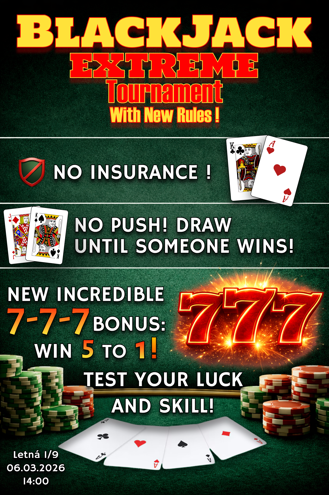

# Creative Ad Concept

Názov reklamy: **BlackJack EXTREME**

Hlavnou myšlienkou reklamy je špeciálna kombinácia troch sedmičiek (777). 
Ak hráč získa kombináciu 777, získava bonusovú výhru s výplatou 5:1. 
Reklama zdôrazňuje moment napätia, keď hráč čaká na tretiu sedmičku, ktorá môže priniesť veľkú výhru.

Slogan:
**Blackjack – tri sekery**

---

# Poster

---

# Business Plan

## Cieľ reklamy
Cieľom reklamnej kampane je zvýšiť povedomie o hre Blackjack a prilákať nových hráčov prostredníctvom výrazného prvku „777“. Reklama zdôrazňuje dynamiku hry, jednoduché pravidlá a možnosť získať bonusovú výhru za kombináciu troch sedmičiek.

## Cieľová skupina
Primárnou cieľovou skupinou sú mladí dospelí vo veku približne 18–35 rokov, ktorí majú záujem o kartové hry, online kasínové hry alebo rýchle strategické hry. Sekundárnou cieľovou skupinou sú príležitostní hráči, ktorí hľadajú jednoduchú a dynamickú hru na oddych.

## Mechanika súťaže
Reklama je prepojená s jednoduchou súťažnou mechanikou. Hráči, ktorí sa zaregistrujú a odohrajú aspoň jednu hru blackjacku počas trvania kampane, budú zaradení do žrebovania o bonusové herné kredity. Kombinácia 777 je prezentovaná ako špeciálny moment hry, ktorý môže hráčovi priniesť bonusovú výhru.

## Prínos pre herné štúdio
Reklamná kampaň môže zvýšiť viditeľnosť hry, prilákať nových hráčov a podporiť aktivitu existujúcich používateľov. Zároveň môže zvýšiť počet registrácií a pomôcť budovať komunitu hráčov prostredníctvom zdieľania obsahu na sociálnych sieťach.